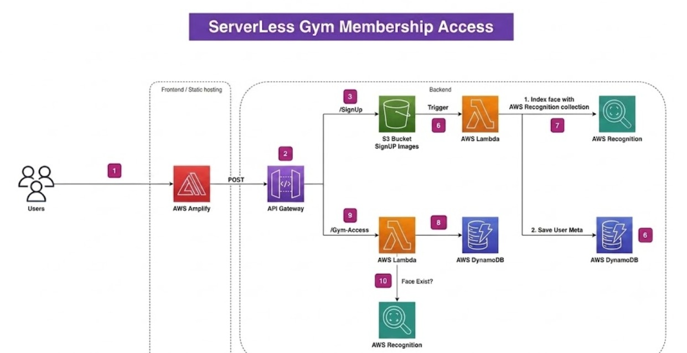
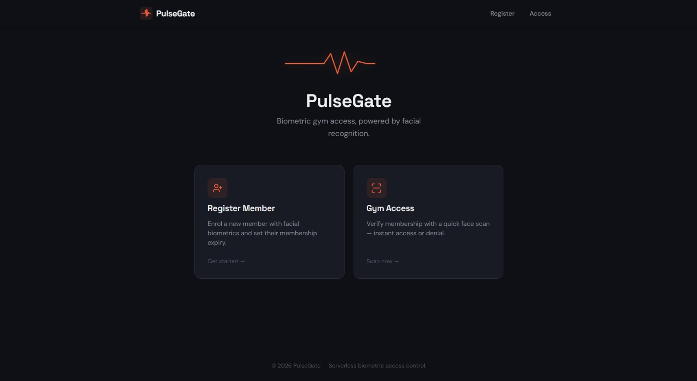
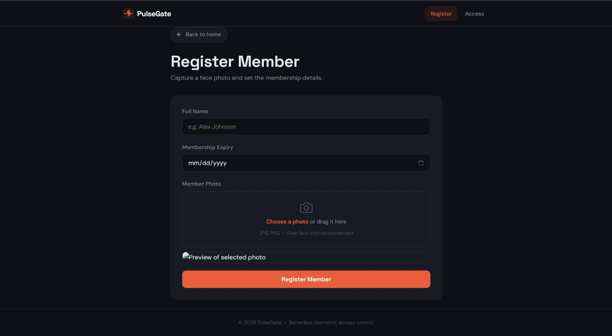
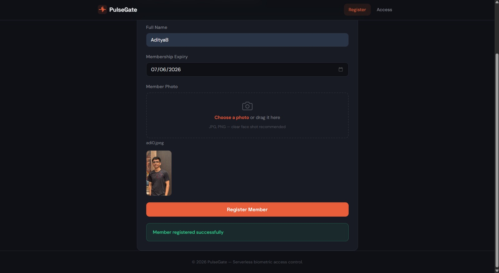
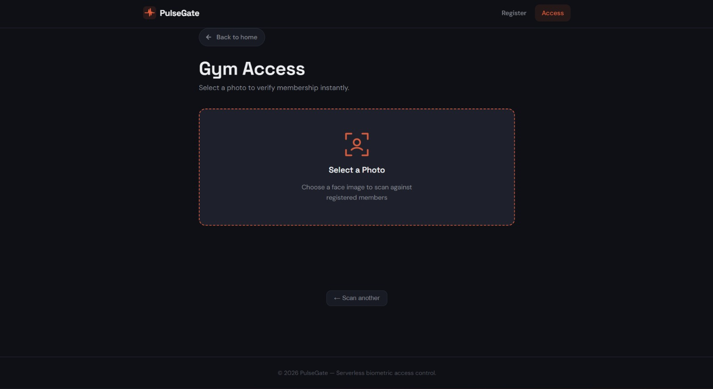
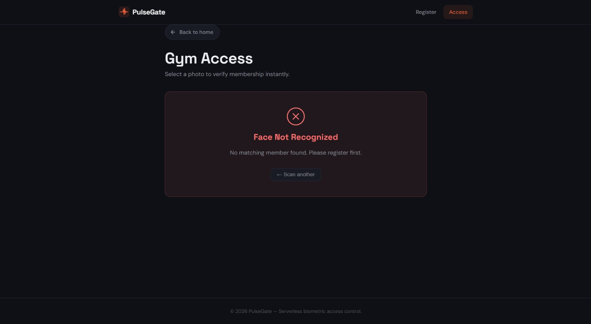

# PulseGate – Serverless Facial Recognition Gym Access System

[](https://aws.amazon.com/)
[](https://www.python.org/)
[](LICENSE)

PulseGate is a **cloud-native serverless gym membership access system** built entirely on **Amazon Web Services (AWS)**. It uses **Amazon Rekognition** to authenticate gym members through facial recognition, enabling secure and automated access control without managing any servers.

The project demonstrates the integration of multiple AWS managed services to build a scalable, event-driven application.

---

# Live Demo

**AWS Amplify**

https://staging.d1l8ewjsaicmif.amplifyapp.com/access.html

---

# Architecture



---

# Features

- Serverless cloud-native architecture
- Facial recognition-based authentication
- Automated member registration
- Real-time gym access verification
- Membership expiry validation
- Secure image storage using Amazon S3
- REST APIs using API Gateway and AWS Lambda
- Responsive frontend hosted on AWS Amplify

---

# AWS Services Used

| Service | Purpose |
|----------|---------|
| AWS Amplify | Frontend hosting |
| Amazon API Gateway | REST API endpoints |
| AWS Lambda | Backend compute |
| Amazon Rekognition | Face indexing & recognition |
| Amazon DynamoDB | Member database |
| Amazon S3 | Image storage |
| AWS IAM | Security & permissions |

---

# Tech Stack

- Python
- HTML
- CSS
- JavaScript
- AWS Amplify
- Amazon API Gateway
- AWS Lambda
- Amazon Rekognition
- Amazon DynamoDB
- Amazon S3
- IAM

---

# System Workflow

## Member Registration

1. User enters member details.
2. User uploads a facial image.
3. Frontend sends the request to Amazon API Gateway.
4. AWS Lambda uploads the image to Amazon S3.
5. Amazon Rekognition indexes the face.
6. Face ID and member details are stored in Amazon DynamoDB.

---

## Gym Access

1. User uploads a live facial image.
2. Frontend sends the request to Amazon API Gateway.
3. AWS Lambda searches the Rekognition face collection.
4. Matching Face ID is retrieved.
5. Member information is fetched from DynamoDB.
6. Membership expiry is validated.
7. Access is granted or denied.

---

# Architecture Diagram

```
Users
   │
AWS Amplify
   │
API Gateway
   │
├───────────────┐
│               │
Signup      Gym Access
 Lambda        Lambda
│               │
├──────┬────────┘
│      │
S3  Rekognition
│      │
└── DynamoDB
```

---

# Repository Structure

```
pulsegate-serverless-access/
│
├── architecture/
│   └── architecture.jpeg
│
├── frontend/
│   ├── index.html
│   ├── register.html
│   ├── access.html
│   ├── css/
│   └── js/
│
├── lambda/
│   ├── signup/
│   │   └── lambda_function.py
│   │
│   └── gym-access/
│       └── lambda_function.py
│
├── screenshots/
│
├── README.md
├── LICENSE
└── .gitignore
```

---

# Screenshots

## Home Page



---

## Member Registration



---

## Registration Successful



---

## Gym Access



---

## Access Granted


---

## Access Denied



---

# API Endpoints

## Register Member

```
POST /signup
```

### Request

```json
{
  "name": "John Doe",
  "expiry": "2026-12-31",
  "image": "<base64-image>"
}
```

---

## Verify Gym Access

```
POST /gym-access
```

### Request

```json
{
  "image": "<base64-image>"
}
```

---

# Security

- IAM Least Privilege permissions
- HTTPS hosted on AWS Amplify
- Serverless architecture
- Secure object storage using Amazon S3
- Facial authentication through Amazon Rekognition

---

# Future Improvements

- Amazon Cognito authentication
- Terraform Infrastructure as Code
- GitHub Actions CI/CD
- Attendance history dashboard
- CloudWatch monitoring
- Route 53 custom domain
- AWS WAF protection

---

# Skills Demonstrated

- Serverless Computing
- Cloud Architecture
- REST API Development
- AWS Service Integration
- Facial Recognition
- IAM Security
- NoSQL Database Design
- Object Storage
- Python Backend Development

---

# Author

**Aditya Bansod**

- LinkedIn: https://www.linkedin.com/in/aditya-bansod12
- GitHub: https://github.com/adityabansod12

---

# License

This project is licensed under the MIT License.
